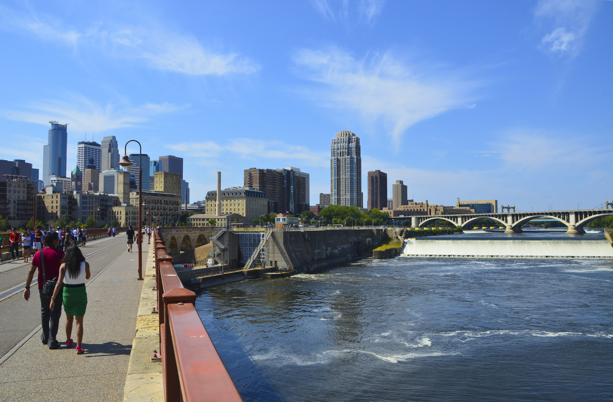
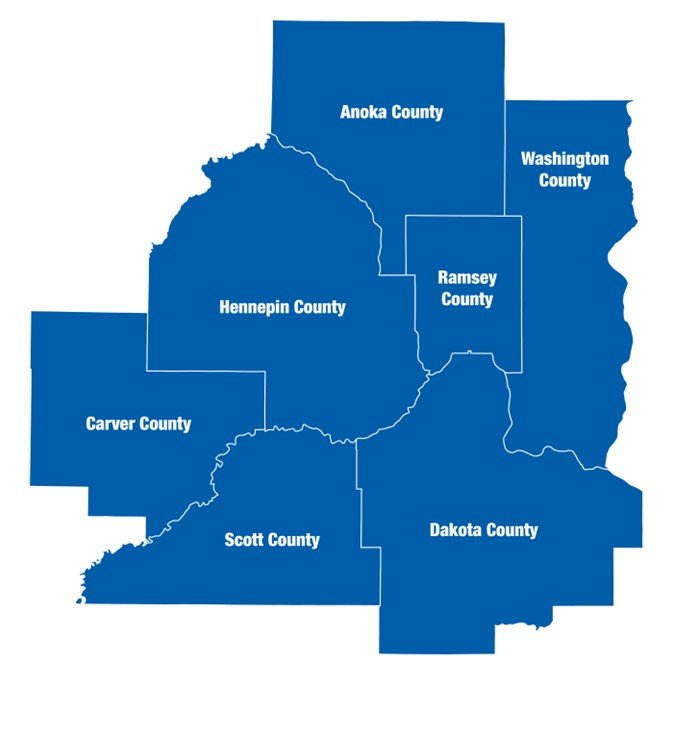

--- 
title: "Greenhouse Gas Emissions Scenario Planning"
author: "Metropolitan Council"
date: "`r format(Sys.time(), '%B %Y')`"
params:
    ctu_selection: "Minneapolis"
    county_selection: "Hennepin"
    desired_format: "html" # or "html" / "docx"
site: bookdown::bookdown_site
documentclass: book
bibliography: [book.bib, packages.bib, references.bib]
# url: your book url like https://bookdown.org/yihui/bookdown
# cover-image: path to the social sharing image like images/cover.jpg
description: |
  This is a report for the City of Minneapolis prepared by the Metropolitan Council
  and published on February of 2023. 
link-citations: yes
#github-repo: rstudio/bookdown-demo
---
#  {.unnumbered}



## Metropolitan Council {.unnumbered}

------------------------------------------------------------------------

```{r fig.align = 'center'}
#| echo: false
#| message: false

councilmember_df <-
  list(councilmembers[1:9, ], councilmembers[10:18, ])

if (params$desired_format == "html") {
  data.frame(councilmember_df) %>%
    flextable::flextable() %>%
    flextable::autofit() %>%
    flextable::delete_part(part = "header") %>%
    flextable::border_remove() %>%
    flextable::fontsize(size = 9)
} else {
  data.frame(councilmember_df) %>%
    flextable::flextable() %>%
    flextable::autofit() %>%
    flextable::delete_part(part = "header")
}
```

::: {#top_container style="display: grid;     grid-template-columns: 1fr 1fr;     grid-gap: 0px; margin-top: 30px"}
{#top_left style="float: left" width="85%"}

::: {#top_right style="float: right;"}
The Metropolitan Council is the regional planning organization for the seven-county Twin Cities area. The Council operates the regional bus and rail system, collects and treats wastewater, coordinates regional water resources, plans and helps fund regional parks, and administers federal funds that provide housing opportunities for low- and moderate-income individuals and families. The 17-member Council board is appointed by and serves at the pleasure of the governor.

***On request, this publication will be made available in alternative formats to people with disabilities. Call Metropolitan Council information at 651-602-1140 or TTY 651-291-0904***
:::
:::

------------------------------------------------------------------------

## Disclaimer {.unnumbered}

::: disclaimer
This report aims to evaluate the effectiveness of greenhouse gas (GHG) mitigation strategies at the city level. It is intended to provide information that can be used to support policy discussions and educational purposes. Please note that the report is for informational purposes only and does not constitute official recommendations or policy decisions.
:::

## Executive Summary {.unnumbered}

The Research Unit of Community Development at the Metropolitan Council has prepared the following report, which presents a range of strategies that the City of `r params$ctu_selection` could adopt to reduce greenhouse gas emissions relative to a "Business as Usual" scenario. These strategies are divided into three categories: stationary energy (building sector), transportation, and land use and forestry. It is worth noting that the greenhouse gas emissions estimates presented in this report may differ from those found in the `r params$ctu_selection` Greenhouse Gas Inventory due to differences in methodology. The strategies included in this report were decided in a series of stakeholder meetings conducted in 2020.
