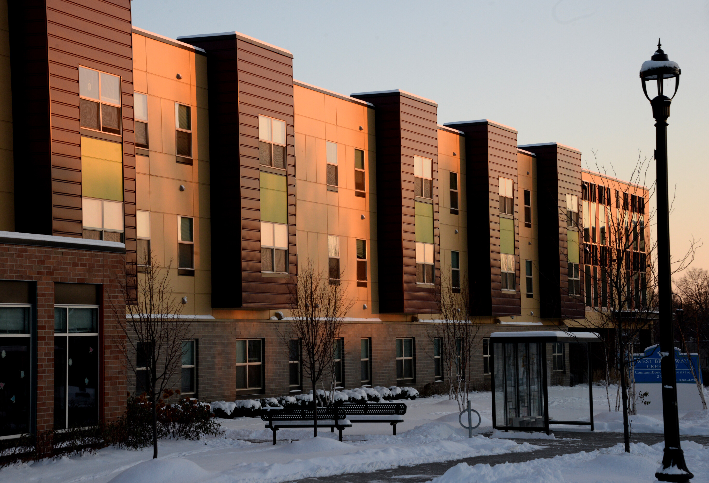
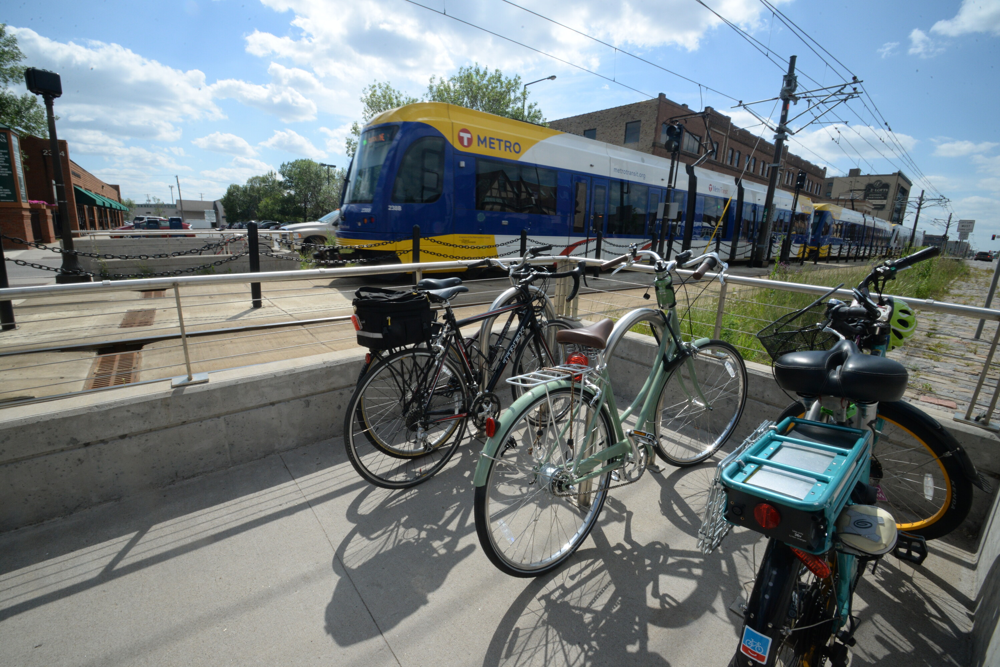

*Prepared for the City of `r params$ctu_selection`*

```{r, include=FALSE}
knitr::opts_chunk$set(
  comment = "#>", echo = FALSE,
  fig.width = 6
)
```

```{r libraries}
#| echo: false
#| message: false
library(ghg.sp)
library(tidyverse)
library(knitr)
library(kableExtra)
library(shiny)

options(scipen = 1, digits = 2)

```

```{r, kableformat}
#| echo: false
kableformat <- function(data, .caption) {
  data %>%
    left_join(., variables, by = "var") %>%
    select(c(desc, value)) %>%
    rename(
      "Variables" = "desc",
      "Value" = "value"
    ) %>%
    kableExtra::kable(
      caption = .caption,
      format = "html",
      escape = FALSE,
      format.args = list(big.mark = ",", digits = 6)
    ) %>%
    kableExtra::kable_classic(
      html_font = "Arial",
      full_width = F,
      font_size = 12
    )
}
```

```{r variables}
#| echo: false
#| message: false
variables <- rbind(
  
  # baseline
  data.frame(
    var = "population",
    desc = "Population"
  ),
  data.frame(
    var = "households",
    desc = "Households"
  ),
  data.frame(
    var = "jobs",
    desc = "Jobs"
  ),
  
  # residential
  data.frame(
    var = "single_family_units",
    desc = "Number of Single Family Units"
  ),
  data.frame(
    var = "single_family_average_floor_area_sqft_ctu",
    desc = "Single Family Average Floor Area (ft<sup>2</sup>)"
  ),
  data.frame(
    var = "single_family_average_floor_area_sqft_county",
    desc = "Single Family Average Floor Area for the County (ft<sup>2</sup>)"
  ),
  data.frame(
    var = "multifamily_units",
    desc = "Number of Multifamily Units"
  ),
  data.frame(
    var = "multifamily_average_floor_area_sqft_ctu",
    desc = "Multifamily Average Floor Area (ft<sup>2</sup>)"
  ),
  data.frame(
    var = "multifamily_average_floor_area_sqft_county",
    desc = "Multifamily Average Floor Area for the County (ft<sup>2</sup>)"
  ),
  
  # commercial_industrial
  data.frame(
    var = "commercial_jobs",
    desc = "Commercial Jobs"
  ),
  data.frame(
    var = "industrial_jobs",
    desc = "Industrial Jobs"
  ),
  data.frame(
    var = "commercial_workers_county",
    desc = "Commercial Jobs"
  ),
  data.frame(
    var = "industrial_workers_county",
    desc = "Industrial Jobs"
  ),
  
  # enegy
  data.frame(
    var = "elec_emis_factor_kg_mwh",
    desc = "Emissions Factor for Electricity (kg/MWh)"
  ),
  data.frame(
    var = "ng_emis_factor_kg_therm",
    desc = "Emissions Factor for Natural Gas (kg/therm)"
  ),
  
  # energy baseline (residential, electricity)
  data.frame(
    var = "residential_mwh",
    desc = "Residential Electricity (MWh)"
  ),
  data.frame(
    var = "residential_kwh_per_floor_area",
    desc = "Residential Electricity per Floor Area (KWh/ft<sup>2</sup>)"
  ),
  data.frame(
    var = "residential_mwh_per_households",
    desc = "Residential Electricity per Household (MWh/household)"
  ),
  data.frame(
    var = "residential_elec_emis_t_co2e",
    desc = "Residential Electricity Emissions (tonnes CO<sub>2</sub>e)"
  ),
  
  # energy baseline (residential, natural gas)
  data.frame(
    var = "residential_therms",
    desc = "Residential Natural Gas (Therms)"
  ),
  data.frame(
    var = "residential_ng_therms",
    desc = "Residential Natural Gas (Therms)"
  ),
  data.frame(
    var = "residential_therms_per_floor_area",
    desc = "Residential Therms per Floor Area (therms/ft<sup>2</sup>)"
  ),
  data.frame(
    var = "residential_therms_per_households",
    desc = "Residential Therms per Household (therms/household)"
  ),
  data.frame(
    var = "residential_ng_emis_t_co2e",
    desc = "Residential Natural Gas Emissions (tonnes CO<sub>2</sub>e)"
  ),
  
  # energy forecast (residential, electricity)
  data.frame(
    var = "total_residential_kwh_forecast",
    desc = "Residential Electricity - Forecast (MWh)"
  ),
  data.frame(
    var = "residential_electricity_emissions_kg_co",
    desc = "Residential Electricity Emissions (kg CO<sub>2</sub>e)"
  ),
  
  # energy forecast (residential, natural_gas)
  data.frame(
    var = "total_residential_therms_forecast",
    desc = "Residential Natural Gas - Forecast (Therms)"
  ),
  data.frame(
    var = "residential_natural_gas_emissions_kg_co",
    desc = "Residential Natural Gas Emissions (kg CO<sub>2</sub>e)"
  ),
  
  # energy baseline (commercial, electricity)
  data.frame(
    var = "commercial_mwh",
    desc = "Commercial Electricity (MWh)"
  ),
  data.frame(
    var = "commercial_mwh_per_worker",
    desc = "Commercial Electricity per Worker (MWh/worker)"
  ),
  data.frame(
    var = "commercial_elec_kwh_per_worker",
    desc = "Commercial Electricity per Worker (KWh/worker)"
  ),
  data.frame(
    var = "commercial_elec_emis_t_co2e",
    desc = "Commercial Electricity Emissions (tonnes CO<sub>2</sub>e))"
  ),
  
  # energy baseline (commercial, natural_gas)
  data.frame(
    var = "commercial_therms",
    desc = "Commercial Natural Gas (Therms)"
  ),
  data.frame(
    var = "commercial_ng_therms",
    desc = "Commercial Natural Gas (Therms)"
  ),
  data.frame(
    var = "commercial_ng_therms_per_worker",
    desc = "Commercial Natural Gas per Worker (therms/worker)"
  ),
  data.frame(
    var = "commercial_therm_per_worker",
    desc = "Commercial Natural Gas per Worker (therms/worker)"
  ),
  data.frame(
    var = "commercial_ng_emis_t_co2e",
    desc = "Commercial Natural Gas Emissions (tonnes CO<sub>2</sub>e))"
  ),
  
  # energy baseline (industrial, electricity)
  data.frame(
    var = "industrial_mwh",
    desc = "Industrial Electricity (MWh)"
  ),
  data.frame(
    var = "industrial_elec_kwh_per_worker",
    desc = "Industrial Electricity per Worker (KWh/worker)"
  ),
  data.frame(
    var = "industrial_mwh_per_worker",
    desc = "Industrial Electricity per Worker (MWh/worker)"
  ),
  data.frame(
    var = "industrial_elec_emis_t_co2e",
    desc = "Industrial Electricity Emissions (tonnes CO<sub>2</sub>e))"
  ),
  
  # energy baseline (industrial, natural_gas)
  data.frame(
    var = "industrial_therms",
    desc = "Industrial Natural Gas (Therms)"
  ),
  data.frame(
    var = "industrial_ng_therms",
    desc = "Industrial Natural Gas (Therms)"
  ),
  data.frame(
    var = "industrial_ng_therms_per_worker",
    desc = "Industrial Natural Gas per Worker (therms/worker)"
  ),
  data.frame(
    var = "industrial_therm_per_worker",
    desc = "Industrial Natural Gas per Worker (therms/worker)"
  ),
  data.frame(
    var = "industrial_ng_emis_t_co2e",
    desc = "Industrial Natural Gas Emissions (tonnes CO<sub>2</sub>e))"
  ),
  
  # energy emissions totals
  data.frame(
    var = "total_residential_emissions",
    desc = "Total Residential Emissions (tonnes CO<sub>2</sub>e)"
  ),
  data.frame(
    var = "total_industrial_commercial_emissions",
    desc = "Total Industrial Emissions (tonnes CO<sub>2</sub>e)"
  )
)

councilmembers <- data.frame(
  name = c(
    "Charlie Zelle",
    "Judy Johnson",
    "Reva Chamblis",
    "Christopher Ferguson",
    "Deb Barber",
    "Molly Cummings",
    "John Pacheco Jr.",
    "Robert Lilligren",
    "Abdirahman Muse",
    "Raymond Zeran",
    "Peter Lindstrom",
    "Susan Vento",
    "Francisco J. Gonzalez",
    "Chai Lee",
    "Kris Fredson",
    "Phillip Sterner",
    "Wendy Wulff",
    ""
  ),
  position = c(
    "Chair",
    "District 1",
    "District 2",
    "District 3",
    "District 4",
    "District 5",
    "District 6",
    "District 7",
    "District 8",
    "District 9",
    "District 10",
    "District 11",
    "District 12",
    "District 13",
    "District 14",
    "District 15",
    "District 16",
    ""
  )
)
```


------------------------------------------------------------------------

Metropolitan Council Members

```{r fig.align = 'center'}
knitr::kable(
  list(councilmembers[1:9, ], councilmembers[10:18, ]),
  booktabs = TRUE,
  col.names = NULL,
  row.names = FALSE
)
```

------------------------------------------------------------------------

::: {#top_container style="display: grid;     grid-template-columns: 1fr 1fr;     grid-gap: 0px; margin-top: 30px"}
{#top_left style="float: left" width="85%"}

::: {#top_right style="float: right;"}
The Metropolitan Council is the regional planning organization for the seven-county Twin Cities area. The Council operates the regional bus and rail system, collects and treats wastewater, coordinates regional water resources, plans and helps fund regional parks, and administers federal funds that provide housing opportunities for low- and moderate-income individuals and families. The 17-member Council board is appointed by and serves at the pleasure of the governor.

On request, this publication will be made available in alternative formats to people with disabilities. Call Metropolitan Council information at 651-602-1140 or TTY 651-291-0904
:::
:::

------------------------------------------------------------------------

## Disclaimer {.unnumbered}

::: disclaimer
This report aims to evaluate the effectiveness of greenhouse gas (GHG) mitigation strategies at the city level. It is intended to provide information that can be used to support policy discussions and educational purposes. Please note that the report is for informational purposes only and does not constitute official recommendations or policy decisions.
:::

## Executive Summary {.unnumbered}

The Research Unit of Community Development at the Metropolitan Council has prepared the following report, which presents a range of strategies that the City of `r params$ctu_selection` could adopt to reduce greenhouse gas emissions relative to a "Business as Usual" scenario. These strategies are divided into three categories: stationary energy (building sector), transportation, and land use and forestry. It is worth noting that the greenhouse gas emissions estimates presented in this report may differ from those found in the `r params$ctu_selection` Greenhouse Gas Inventory due to differences in methodology. The strategies included in this report were decided in a series of stakeholder meetings conducted in 2020.

# Introduction

## Overview

Cities throughout the Minnesota Metro Region are well aware of the pressing need to reduce greenhouse gas emissions and enhance the resilience of their communities in the face of climate change. In recognition of this urgency, many of these cities, including `r params$ctu_selection`, have already begun implementing various strategies and initiatives to reduce their carbon footprint and increase their ability to withstand the impacts of a changing climate. These efforts range from adopting renewable energy sources and energy-efficient technologies to implementing transportation policies that encourage using electric or low-emissions vehicles to promote land use practices that support the retention and expansion of natural habitats. By taking action at the local level, local governments in the Twin Cities contribute to the global effort to mitigate the worst effects of climate change and build a more sustainable and equitable future.

This report aims to support the City of `r params$ctu_selection` in considering potential strategies for reducing carbon emissions. The Metropolitan Council seeks to expand the information and technical assistance it provides to local governments to support regional and local climate change planning. The Council offers tools and guidance to help get cities on track to meet local, regional, and state goals.

## Greenhouse Gas Emissions

Greenhouse gases (GHG) trap heat in the atmosphere and contribute to global warming. Carbon dioxide, methane, and nitrous oxide are the most common greenhouse gases. Human activities have been the primary driver of climate change by releasing greenhouse gases in large amounts. Combustion of fossil fuels (e.g., coal, oil, and natural gas) releases greenhouse gases, which trap heat in the atmosphere, causing temperatures to rise.

The primary sources of emissions in cities come from building energy use (electricity and natural gas), transportation (gas and diesel), and waste (methane at landfills or combustion for energy generation). The transportation sector, which includes cars, trucks, ships, and airplanes, is the largest source of carbon dioxide emissions in the United States, followed by the electricity and heat production and industrial sectors. Other sources of greenhouse gas emissions in Minnesota include agriculture, waste, and industrial processes.

## Impact of Climate Change in Minnesota

The climate in Minnesota is changing, leading to more extreme rain events, heat waves, and drought. These changes will have significant impacts on transportation, waste water services, and water resources in the region.

Extreme heat events will increase water demand, leading to higher energy use, treatment costs, and lower efficiency in water supply systems. More extreme rain events will lead to more erosion, rainwater runoff, and flooding, disrupting transportation operations and damaging sewer and storm-water systems. Drought will lead to lower groundwater levels, stressed water resources, and more algal blooms and fish kills. These impacts will disproportionately affect marginalized communities and require the region to adapt and become more resilient to these changes.

## Scenario Planning

The Metropolitan Council has developed a Greenhouse Gas Scenario Planning Tool to help metro cities determine pathways to achieving emissions reductions. The Tool builds upon the DECAL model created by the Sustainable Healthy Cities Network with the support and funding of the Metropolitan Council.

Scenario planning is a method to make flexible long-term plans. It is a way of thinking about and preparing for the future by considering possible events and their potential impact on a city or region. Scenario planning involves creating multiple possible future scenarios and then considering how to respond to each one. This method allows organizations to be more flexible and adaptable in uncertainty and change.

The Greenhouse Gas Scenario Planning Tool looks at strategies across multiple sectors and calculates the emissions reductions that can result from successful implementation. These sectors include compact land use, mobility, buildings, waste, and green infrastructure.

The Metropolitan Council will offer the scenario planning tool on an easy-to-use online platform. Cities can use this Tool to identify solutions tailored to their communities by testing different scenarios across strategies.

The following report compiles the City of `r params$ctu_selection` results based on the Greenhouse Gas Scenario Planning Tool created by the Metropolitan Council and adapted from the collaborative work between the Sustainable Healthy Cities Network and the Metropolitan Council.

## Stakeholder Engagement

In April and May of 2022, the Metropolitan Council conducted a series of community stakeholder engagement sessions to gather input regarding crucial considerations in designing the Greenhouse Gas Scenario Planning Tool. The stakeholder meetings were organized by different interest groups, which included local governments and counties, non-profit think tanks, advocacy groups, private consulting firms, academia, and staff from different divisions at the Metropolitan Council.

The stakeholders identified several priorities for developing the Greenhouse Gas Scenario Planning Tool, including (in ranking order) vehicle electrification, grid renewables, building retrofits, mixed-use development, and building codes.

### Vehicle Electrification

Vehicle electrification ranked first in a list of strategies stakeholders wanted to explore in the Greenhouse Gas Scenario Planning Tool because it has the potential to reduce greenhouse gas emissions and improve air quality in the transportation sector. During the stakeholder engagement, the community members emphasized the trend towards electrification of short trips in the vehicle industry and the need to factor in changes to the grid electricity mix as electric vehicle adoption increases. They also emphasized the importance of quickly adopting electric vehicles and reducing vehicle miles traveled (VMT) to achieve environmental justice and improve air quality. The stakeholders asked if it is possible to model the effects of EV adoption on localized pollution. Overall, the community members emphasized the potential benefits of vehicle electrification and the need to consider its impacts on the grid and local air quality.

### Grid Renewables

"Grid renewables" refer to using renewable energy sources, such as solar or wind power, to generate electricity for the grid. During the stakeholder engagement sessions, community members highlighted the importance of modeling grid renewables because it is a significant emission lever, even though it is not within local government control and is often already modeled by utilities. Local governments can influence the grid mix by working together and speaking with a unified voice. They can also purchase [Renewable Energy Certificates](https://www.leg.mn.gov/docs/2019/mandated/190330.pdf)[^1] (RECs) to obtain green power. The ownership of solar assets and the retirement of RECs can affect the benefits and amount of renewable energy added to the grid through community solar projects. Focusing on grid renewables and community solar can maximize equity benefits and is more important than improving access to rooftop solar.

[^1]: The Minnesota Statute section 216B.1691 was amended in 2003 and 2007 to allow for the establishment of a program for tradable Renewable Energy Credits (RECs). The Public Utilities Commission was required to establish this program by 2008 and to require all electric utilities to participate in a Commission-approved REC tracking system. In 2007, the Commission approved the use of the [Midwest Renewable Energy Tracking System](https://www.mrets.org/) (M-RETS) as the REC tracking system and set a four-year shelf life for RECs. This means that RECs are eligible to be used to meet Renewable Energy Standard (RES) requirements in the year they are generated and for four years afterwards. In 2008, the Commission directed utilities to retire RECs equivalent to 1% of their Minnesota annual retail sales by May 1st of the following year. These retired RECs are transferred to a specific Minnesota RES retirement account and cannot be used to meet other state or program requirements. Utilities must submit an annual compliance filing demonstrating their compliance with the RES by June 1st.

### Building Retrofits

During the stakeholder engagement, the community members commented that building retrofits are vital because they can increase energy efficiency, which could benefit low-income people the most. It is important to model more high-level, general strategies that will be relevant in the future rather than more specific, short-term strategies that may be affected by changing circumstances or policy priorities. Building retrofits have the potential for city and utility collaboration, as utilities often offer tools and programs to increase efficiency. The feasibility and cost of building electrification should be considered to ensure that it benefits the community beyond reducing emissions. It may also be beneficial to consider participation in the new "*LEED for Communities*" program. Commercial building energy benchmarking may be more effective than focusing on residential buildings.

### Mixed-Use Development

Mixed-use development involves building buildings with multiple functions, such as housing, offices, and retail spaces, in a single location. Unlike many other strategies, such as increasing grid renewables or improving building codes, which may be outside local government control, the stakeholder mentioned that mixed-use development is within the control of local governments. Local governments have the authority to regulate land use and development in their jurisdictions, including the construction of mixed-use buildings.

### Building Codes

Building codes refer to the regulations and standards governing building design and construction, including energy efficiency requirements. These priorities can help to create more sustainable and livable communities. The report discusses the impact of building standards such as LEED Gold for residential development.


# Demographic Assumptions

The Greenhouse Gas Scenario Planning Tool uses the best available demographic assumptions for cities in the Metropolitan Region to forecast emissions in 2040.

Some common predictors of greenhouse gas emissions at the city scale include:

::: facts
-   ***Population Density*** Minneapolis, the largest city in Minnesota, has a high population density. Higher density means more people live in a relatively small area compared to other regions' cities. Higher population densities are often associated with increased energy consumption, as residents need to use energy for daily activities and power local businesses. However, higher population density can also lead to more efficient use of resources and infrastructure, which can ultimately reduce the environmental impact of development in an area.

-   ***Economic Activity*** According to the [Minnesota Department of Employment and Economic Development](https://mn.gov/deed/data/economic-analysis/compare/compare-metro/economy/gdp.jsp), the Twin Cities region ranks 8th in the country in terms of Gross Domestic Product (GDP) following the Denver region. Cities with higher levels of economic activity, such as manufacturing or transportation, tend to consume more energy due to the increased energy demand of these activities.

-   ***Urban Planning*** The physical layout of a city can also affect energy consumption. For example, cities with more compact, walkable neighborhoods may have lower energy consumption due to the reduced need for transportation. The [Minneapolis Transportation Action Plan](https://go.minneapolismn.gov/) was formally adopted by the Minneapolis City Council on December 2020. The plan discusses how in the past, streets have been designed primarily with car movement in mind, leading to wide roads and complex intersections that can be uncomfortable or difficult for pedestrians, bicyclists, and those with special mobility needs to navigate. The city has recognized these issues and has adopted policies such as the Climate Action Plan and the Complete Streets Policy to prioritize people over cars in street design and create more welcoming public spaces for all community members.

-   ***Extreme Climate*** Minneapolis has a humid continental climate, which is characterized by hot summers and cold winters. The climate of a city can play a significant role in energy consumption. For example, more energy may be needed for heating in colder regions, while in hotter regions, more energy may be needed for air conditioning.

-   ***Energy efficiency*** Finally, a city's energy consumption may be influenced by the efficiency of its energy use. For example, cities with more energy-efficient buildings and transportation systems may consume less energy overall. Since adopting the Climate Action Plan in 2013, Minneapolis has implemented several programs and policies to reduce energy use in buildings, including a commercial benchmarking ordinance, a green cost share program, and a clean energy partnership with its electric and natural gas utilities. The city has also established a green building program to encourage the construction of high-performing, energy-efficient buildings.
:::

<br>

## Demographic Baseline

We obtained the population, households, and employment numbers from the [US Census and American Community Survey](https://www.census.gov/programs-surveys/acs) (ACS), a nationwide survey conducted by the United States Census Bureau to collect data on a variety of social, economic, and demographic characteristics of the American population.

```{r tab-demographic-assumptions}
#| echo: false
get_demographic_baseline(tb = building_energy_data)$ctu %>%
  ungroup() %>%
  filter(
    ctu_name == params$ctu_selection,
    var != "multifamily_average_floor_area_sqft_county"
  ) %>%
  kableformat(
    .,
    paste(
      "Basic Demographic Assumptions for",
      params$ctu_selection,
      "for 2018"
    )
  )
```

<br>

In cases when there are data gaps for city-level data, the Greenhouse Gas Scenario Planning Tool defaults to average county-level assumptions. **Table \@ref(tab:tab-demographic-assumptions-county) ** shows the relevant assumptions for `r params$county_selection` County.

```{r tab-demographic-assumptions-county}
#| echo: false
get_demographic_baseline(tb = building_energy_data)$county %>%
  ungroup() %>%
  filter(co_name == params$county_selection) %>%
  kableformat(., "Basic Demographic Assumptions Hennepin County for 2018")
```

<br>

### Demographic Forecast

The Metropolitan Council, as part of its responsibilities, produces a forecast of population, households, and employment for all cities within its region using the REMI PI Model, a computer-based forecasting system that projects future trends based on economic, demographic, and social data. This forecast helps the Council plan for the future needs of the region, including infrastructure, housing, and other resources. The floor area assumptions are based on an extrapolation of recent historic trends in floor area growth using data from the [County Assessor Parcel](https://www.hennepin.us/residents/property/property-information-search) dataset and the Zillow [ZTRAX](https://www.zillow.com/research/ztrax/) dataset.

```{r tab-demographic-forecast}
#| echo: false
calc_demographic_forecast(tb = building_energy_data)$ctu %>%
  ungroup() %>%
  filter(
    ctu_name == params$ctu_selection,
    var != "multifamily_average_floor_area_sqft_county"
  ) %>%
  kableformat(.,
              .caption = paste("Demographic Forecast for", params$ctu_selection, "for 2040")
  )
```

<br>

**Figure \@ref(fig:figure-demographics)** shows the comparison of population for the City of `r params$ctu_selection` in 2018 with the 2040 forecast.

```{r fig-inputs, fig.align='center'}
# selectInput(
#   "variable",
#   "Select a variable:",
#   choices = c("Population" = "population",
#               "Households" = "households")
# )
```

```{r figure-demographics}
#| fig.align = 'center'
plot_demo <- function(variable) {
  bind_rows(
    get_demographic_baseline(tb = building_energy_data)$ctu %>%
      filter(ctu_name == "Minneapolis"),
    calc_demographic_forecast(tb = building_energy_data)$ctu %>%
      filter(ctu_name == "Minneapolis")
  ) %>%
    filter(var == variable) %>%
    ggplot(., aes(x = as.factor(year), y = value)) +
    geom_bar(
      stat = "identity",
      width = 0.4,
      color = "black",
      fill = "black"
    ) +
    theme(
      panel.background = element_rect(fill = "white"),
      panel.grid = element_blank(),
      axis.title = element_text(size = 14)
    ) +
    xlab("Year") +
    ylab(variable)
}

plot_demo("population")
plot_demo("households")
```

<br>



# Reducing Emissions in the Building Energy Sector 

There are several strategies that can be employed to reduce emissions in the building energy sector, including improving efficiency, transitioning to low-carbon electricity sources, electrifying heating systems, adopting sustainable construction practices, and changing behaviors to use energy more efficiently.

**Status of the Electricity Grid**

When it comes to reducing emissions in the building sector, the electricity grid, and the percent that it is supplied by renewable sources plays a major role.

Electricity in Minneapolis is served by Xcel Energy. In their report *Building a Carbon Free Future* in 2019, the utility states their goal to provide carbon-free electricity to all of its customers by 2050. The company aims to reduce carbon emissions by 80% by 2030 as an interim goal.

## Residential Energy Assumptions

The biggest share of residential electricity use is typically for heating and cooling. In the United States, heating and air conditioning account for about half of the average home's energy use. Therefore, for the residential sector, electricity and natural gas used tend to be closely correlated with the square footage of a building.

### Residential Energy Baseline

**Table \@ref(tab:tab-residential-energy-assumption)** shows the basic assumptions about electricity and natural gas use for the baseline year of 2018 for the City of `r params$ctu_selection`.

```{r tab-residential-energy-assumption}
#| echo: false
get_residential_energy_baseline() %>%
  ungroup() %>%
  filter(ctu_name == params$ctu_selection) %>%
  kableformat(.,
              .caption = paste(
                "Residential Energy Assumption for",
                params$ctu_selection,
                "for 2018"
              )
  )
```

<br>

### Residential Energy Forecast

The residential energy forecast is a prediction of the energy consumption of the city in the year 2040. It is produced by taking the demographic forecast (discussed in section 2.2), which is a projection of the population size, and an extrapolating the historical floor area growth rate for the last ten years (based on 2018).

The floor area growth rate is the rate at which the total floor area of buildings in a given area is increasing over time. It is calculated by dividing the change in floor area from one year to the next by the initial floor area. For example, if the floor area of a residential area increased by 10% from one year to the next, the floor area growth rate would be 10%.

**Table \@ref(tab:tab-residential-energy-forecast)** shows the forecast assumption for the residential energy sector.

```{r tab-residential-energy-forecast}
#| echo: false
calc_residential_energy_forecast() %>%
  ungroup() %>%
  filter(ctu_name == params$ctu_selection) %>%
  mutate(value = if_else(var == "total_residential_kwh_forecast", value / 1000, value)) %>%
  kableformat(.,
              .caption = paste(
                "Residential Energy Forecast for",
                params$ctu_selection,
                "for 2040"
              )
  )
```

<br>

### Residential Energy Strategies

#### Reducing Residential Floor Area and Improving Efficiency

Energy consumption is directly correlated to the floor area of a residential unit. Therefore, we have calculated the impact of different strategies that directly alter the size of homes.

The *Minneapolis 2040 Comprehensive Plan* aimed to increase housing supply and address affordability and segregation issues by eliminating single-family zoning and allowing up to three units per property. Currently the plan is facing criticism and legal challenges, including a recent court decision halting enforcement of the plan on environmental grounds. Despite this, single family zoning remains a significant strategy to consider in how the city could meet its ambitious climate goals.

Cities have a range of tools at their disposal to control the size of new single family homes and to encourage the construction of smaller, more efficient homes.

The City of `r params$ctu_selection` can influence the size of new single family homes in a variety of ways, including:

::: facts
-   ***Design guidelines******* Cities can adopt or develop design guidelines that specify the size and appearance of new single family homes. These guidelines can be used to encourage the construction of smaller homes. There are several different energy efficiency building design standards, such as Passive House standards, which consume less than 18 of kilo BTUs, as well as new LEED performance-based energy efficiency standards and others. Minnesota's B3 Buildings Benchmarking project offers a long-term approach to benchmark increases in energy efficiency of existing and new buildings per square foot.

-   ***Zoning regulations*** The City of Minneapolis has a range of residential zoning categories, including single-family, multifamily, and mixed-use zones, which are designed to accommodate different types of housing and land uses. A city can use zoning regulations to specify the size of new single family homes. For example, the city might require that new single family homes have a minimum or maximum square footage, or that they be a certain percentage of the size of the lot on which they are built.

-   ***Incentives*** a city can offer incentives to encourage the construction of smaller single family homes. For example, a city might offer reduced permit fees or other financial incentives to builders who construct homes that meet certain size requirements.

-   ***Fees*** Cities can impose impact fees on new construction in order to offset the costs of providing infrastructure and other services. Impact fees can be used to discourage the construction of larger homes by imposing higher fees on larger homes.
:::

#### Promote Affordable Floor Area

If the availability of fossil fuel sources such as oil, natural gas, and coal is limited, prices may increase as demand outstrips supply. New single-family homeowners may respond to increased energy prices by decreasing their living space in order to save on energy costs. This could involve reducing the size of the home or making other changes to the layout or design of the home to make it more energy efficient.

::: about_strategy
***About this strategy*** Our assumption is that cities can control (or at least influence) the size of new single-family homes to reduce energy use and increasing affordability. For this strategy, the growth of the single-family home size is reduced from `15%` to `5%`to make the new single-family home smaller. We apply this impact to `50%` of new single-family homes. Cities can adjust the growth rate of single-family homes' floor area and the percentage of new single-family homes being controlled.
:::

\begin{equation}
sqft_{2040}^{sf} = (units_{2040}^{sf} -units_{2018}^{sf}) * 0.5 * \left(\bar{sqft}_{2040}^{sf}-(1+X) * \bar{sqft}_{2018}\right)   (\#eq:sqft_units_2040)
\end{equation}

where

-   $(1+X)$: The rate of growth in single-family floor area in square feet per year.

-   $sqft_{2040}^{sf}$: The total floor area of single-family homes in the community in 2040. $units_{2040}^{sf}$: The number of single-family housing units in the community in 2040.

-   $units_{2018}^{sf}$: The number of single-family housing units in the community in 2018.

-   $0.5$: This factor represents the assumption that half of the population will reduce the living space of new single-family homes in response to doubling energy prices.

-   $\bar{sqft}_{2040}^{sf}$: The average floor area of single-family homes in the community in 2040.

-   $\bar{sqft}_{2018}$: The average floor area of single-family homes in the community in 2018.

```{r tab-new-single-family-home-area}
#| echo: false
#| 
calc_affordable_floor_area(
  res_tb = building_data$residential,
  .single_family_floor_area_growth_pct = 0.05
) %>%
  ungroup() %>%
  filter(
    ctu_name == params$ctu_selection,
    year == 2040,
    var %in% c(
      "multifamily_average_floor_area_sqft_county",
      "multifamily_units",
      "single_family_units",
      "single_family_average_floor_area_sqft_ctu"
    )
  ) %>%
  kableformat(.,
              .caption = paste(
                "New Single-Family Home Floor Area for",
                params$ctu_selection,
                "for 2040"
              )
  )
```

<br>

#### Promote New Homes Energy Efficiency

*LEED* (Leadership in Energy and Environmental Design) is a green building rating system that is used to evaluate the sustainability of buildings. Buildings that meet *LEED* standards are designed and constructed to be energy efficient and to use fewer natural resources.

The amount of energy savings that can be achieved through *LEED* certifications will depend on the specific design and construction practices that are used, as well as the location and climate of the building. According to the [U.S. Green Building Council](https://www.usgbc.org/leed/rating-systems/residential), buildings that are designed to meet *LEED* Gold standards typically achieve energy savings of around 25% compared to conventional buildings.

The Greenhouse Gas Scenario Planning Tool uses *LEED Gold* for residential buildings as an example of how building standard could reduce energy use and therefore carbon emissions.

::: about_strategy
***About this strategy*** Our main assumption is that cities can adjust the percentage of new homes achieving a standard like LEED. Cities can adopt strict building codes requiring new homes to achieve LEED Gold (or similar) standards. We assumed `50%` of new homes (single and multifamily homes) to be LEED-Gold with both electricity and gas energy use intensity reduced `64%`. Existing home: `80%` reduced EUI by `33%`.
:::

```{r tab-new-home-efficiency}
#| echo: false
calc_floor_area_leed(
  res_tb = building_data$residential,
  .new_homes_leed_gold_pct = 0.5,
  .enviro_factors = enviro_factors
) %>%
  ungroup() %>%
  filter(
    year == 2040,
    var %in% c(
      "multifamily_average_floor_area_sqft_county",
      "multifamily_units",
      "single_family_units",
      "single_family_average_floor_area_sqft_ctu"
    )
  ) %>%
  filter(ctu_name == params$ctu_selection) %>%
  kableformat(., .caption = paste("New Home Efficiency", params$ctu_selection, "2040"))
```

<br>

$$sqft_{2040}^{sf} = X * (units_{2040}^{sf}-units_{2018}^{sf}) * \bar{sqft}_{2040}^{sf}) * 0.64 \text{, where } 0 \le X_1 \le 1$$

-   $X$: The percentage of new homes that are LEED Gold.
-   $sqft_{2040}^{sf}$: The total floor area of single-family homes in the community in 2040.
-   $units_{2040}^{sf}$: The number of single-family housing units in the community in 2040.
-   $units_{2018}^{sf}$: The number of single-family housing units in the community in 2018.
-   $\bar{sqft}_{2040}^{sf}$: The average floor area of single-family homes in the community in 2040.
-   $0.64$: This factor represents the reduction in energy use intensity due to highly-efficient LEED Gold construction.

#### Increase Existing Homes Energy Efficiency

There are multiple ways in which a city, like `r params$ctu_selection`, can promote the retrofit of existing homes to gain energy efficiency. Some examples include:

::: facts
-   ***Develop education and outreach programs******* Cities can develop education and outreach programs to inform homeowners about the benefits of energy-efficient home retrofits and how to access available resources and incentives. According to the Center for Energy and Environment (CEEE) [the Energy Disclosure Program](https://www.mncee.org/energy-disclosure-impact-report-january-2020-through-june-2022) in Minneapolis aims to increase consumer awareness of energy performance in single-family homes in order to encourage the adoption of energy efficiency improvements. The program has been in place since January 2020 and is a part of the city's Truth in Sale of Housing (TISH) pre-sale inspection process. It involves gathering data on key energy efficiency attributes such as insulation and heating equipment, and communicating the results to home sellers and buyers in an Energy Disclosure Report. The program is being implemented in partnership with the Center for Energy and Environment and CenterPoint Energy, and this report summarizes findings from the first 30 months of programming.

-   ***Offer financial incentives*** Cities can offer financial incentives, such as rebates or low-interest loans, to encourage homeowners to invest in energy-efficient home retrofits. The City of Minneapolis, offers incentives and [rebates for homeowners](https://www2.minneapolismn.gov/business-services/licenses-permits-inspections/construction-permits-certificates/construction-code-rules-enforcement/incentives-rebates/) for replacing less efficient equipment.

-   ***Establish building codes and regulations******* Cities can establish building codes and regulations that require or encourage energy-efficient retrofits in new construction and renovations.

-   ***Implement energy audits******* Minneapolis residents might be eligible for program such as the Home Energy Squads which free visits by energy auditors to income qualifying households. Cities can offer energy audits to help homeowners identify areas where their homes are losing energy and recommend cost-effective retrofits.

-   ***Partner with local organizations******* Cities can partner with local organizations, such as non-profits or utility companies, to offer resources and assistance to homeowners interested in energy-efficient retrofits.
:::

::: about_strategy
***About this strategy*** Cities can retrofit existing homes to be energy efficient. We assume `80%` of existing homes with energy use intensity reduced by `33%`. Cities can adjust the percentage of existing homes to be retrofitted.
:::

```{r tab-existing-home-efficiency}
#| echo: false
calc_floor_area_retrofit(
  res_tb = building_data$residential,
  .existing_home_retrofit_pct = 0.80,
  .existing_home_ultra_retrofit_pct = 0.20,
  .enviro_factors = enviro_factors
) %>%
  ungroup() %>%
  filter(
    year == 2040,
    var %in% c(
      "multifamily_average_floor_area_sqft_county",
      "multifamily_units",
      "single_family_units",
      "single_family_average_floor_area_sqft_ctu"
    )
  ) %>%
  filter(ctu_name == params$ctu_selection) %>%
  kableformat(., .caption = paste("Existing Home Efficiency", params$ctu_selection, "2040"))
```

$$sqft_{2040}^{sf+mf} = (units_{2018}^{sf} * X * 0.33 * \bar{sqft}_{2018}^{sf} + units_{2018}^{mf} * X * 0.33 * \bar{sqft}_{2018}^{mf})$$

-   $0.33$: Percent reduction in energy use intensity due to efficiency gains of the retrofitting.
-   $X$: The percentage of existing homes to be retrofitted. This value can be adjusted by the user and is defaulted to 80%.
-   $units_{2040}^{sf}$: Number of single-family housing units in 2018.
-   $units_{2018}^{mf}$: The number of multi-family homes in 2018.
-   $\bar{sqft}_{2018}^{sf}$: The 2018 average floor area of single-family homes.
-   $\bar{sqft}_{2018}^{mf}$: The average floor area of multi-family homes in 2018.

#### Promote Behavior Change for Residential Energy Efficiency

implementing efficient messaging, in-home energy displays, and smart meters can be an effective way to reduce household energy use, but the actual impact may depend on the specific circumstances of each city and the participation rate of households in these actions.

::: about_strategy
***About this strategy*** Efficient messaging, in-home energy display, and smart meters together can reduce household energy use by `11%`. The default is `100%` of homes change behaviors due to these actions. Cities can adjust this participation rate accordingly.
:::

```{r tab-behavior-change}
#| echo: false
calc_floor_area_behavior_change(
  res_tb = building_data$residential,
  .home_behavior_change_pct = 1.00,
  .enviro_factors = enviro_factors
) %>%
  ungroup() %>%
  filter(
    year == 2040,
    var %in% c(
      "multifamily_average_floor_area_sqft_county",
      "multifamily_units",
      "single_family_units",
      "single_family_average_floor_area_sqft_ctu"
    )
  ) %>%
  filter(ctu_name == params$ctu_selection) %>%
  kableformat(., .caption = paste("Behavior Change", params$ctu_selection, "2040"))
```

<br>

$$ sqft_{2040}^{sf+mf} = X * population_{2040} * sqft_{2040}^{sf + mf }/population_{2040} * 0.11 $$

-   $0.11$: The percentage reduction in household energy use as a result of smart nudges.
-   $X$: The percentage of homes that change their behavior for energy efficiency.
-   $population_{2040}$: The total population in 2040.
-   $sqft_{2040}^{sf+mf}/population_{2040}$: The average square footage per person in 2040 for residential buildings.

#### Decarbonize Residential Energy Use

The energy grid could become cleaner by increasing the use of renewable energy sources such as solar, wind, and hydroelectric power, which produce significantly fewer greenhouse gas emissions than fossil fuels

::: about_strategy
***About this strategy***: Due to decarbonizing the grid, the emission factor of electricity decreases from `568` kg<sub>2</sub>e/MWh (2018 Minnesota state level) to `113` kgCO<sub>2</sub>e/MWh. This change is fixed by the grid.
:::

```{r tab-decarbonize-residential-energy}
#| echo: false
calc_ghg_residential(
  res_tb = building_energy_bau_data$residential,
  res_tb_bau = building_energy_bau_data$residential,
  .grid_decarbonization_pct = 0.8,
  .enviro_factors = enviro_factors
) %>%
  ungroup() %>%
  filter(
    ctu_name == params$ctu_selection,
    year == 2040,
    scen == "scen",
    var %in% c(
      "residential_mwh",
      "residential_electricity_emissions_kg_co",
      "residential_therms",
      "residential_natural_gas_emissions_kg_co"
    )
  ) %>%
  kableformat(., .caption = "Decarbonize Residential Energy Use Minneapolis 2040")
```

<br>

$$
kgCO_2e = (population_{2040} * sqft/person_{2040}^{residential} * kWh/sqft_{residential}^{2040}) 
$$

#### Electrifying Residential Heating

The Greenhouse Gas Scenario Planning Tool estimates that by 2040, Minnesota will decarbonize the overall grid to 80% relative to 2018 levels, consistent with Xcel Energy's plans to achieve a net-zero power grid by 2050.

Switching to more efficient electric heat pumps and tank-less water heaters with a net zero-carbon future electric grid can significantly reduce emissions.

Only around 14% of homes in MN have adopted these new technologies.2 The scenario planning tool projects that by 2050, 59% of residential and commercial buildings will switch to electrically driven heat pumps,3 which can heat and cool homes while offering long-term cost savings. Furthermore, the scenario planning model utilizes efficiency of the heat pump derived from pilot tests in Minnesota,4 so the results are more realistic for our region. National studies indicate 100% adoption of electric heat pumps may be unlikely in cold areas, due to which we also model renewable natural gas for the remaining buildings, described in the following strategy.

Electricity can be generated from various sources, including renewable energy sources such as solar, wind, and hydroelectric power. Using electricity for heating, cooling, and other household energy needs can reduce greenhouse gas emissions compared to fossil fuels such as natural gas, propane, and oil.

::: about_strategy
**About this strategy** For this strategy, we made the assumption that by 2040 `59%` of homes are using air-source heat pumps and electric water heaters, instead of using gas for heating. Cities can adjust the percentage of homes participated in electrifying heating.
:::

```{r tab-electrify-residential-heating}
#| echo: false
#| warning: false
calc_electrify_residential_heating(
  res_tb = calc_ghg_residential(
    res_tb = building_energy_bau_data$residential,
    res_tb_bau = building_energy_bau_data$residential,
    .grid_decarbonization_pct = 0.8,
    .enviro_factors = enviro_factors
  ),
  .additional_electrified_residential_buildings_pct = 0.45,
  .res_natural_gas_for_space_heating_pct = 0.71,
  .res_natural_gas_for_water_heating_pct = 0.24,
  .grid_decarbonization_pct = 0.80,
  .enviro_factors = enviro_factors
) %>%
  ungroup() %>%
  filter(
    year == 2040,
    ctu_name == params$ctu_selection,
    scen == "scen"
  ) %>%
  kableformat(.,
              .caption = paste(
                "Electrifying Residential Heating",
                params$ctu_selection,
                "2040"
              )
  )
```

<br>

## Non-Residential Energy Assumptions

Non-residential energy use refers to the energy consumption of commercial and industrial buildings, including both electricity and natural gas. This energy use is estimated by considering the size of the commercial and industrial buildings, as well as the number of people who are expected to work in these buildings.

In addition to electricity and natural gas, non-residential energy use may also include other energy sources such as propane, fuel oil, and renewable energy sources. Accurate estimates of non-residential energy use can help the City of Minneapolis make informed decisions about energy efficiency and conservation efforts.

### Non-Residential Energy Baseline

\@\@ shows the basic assumptions about non-residential electricity and natural gas use for the baseline year of 2018 for the City of Minneapolis.

```{r tab-non-residential-energy-baseline}
#| echo = FALSE
get_non_residential_energy_baseline(tb = building_energy_data) %>%
  ungroup() %>%
  filter(ctu_name == params$ctu_selection) %>%
  kableformat(.,
              .caption = paste("Non-Residential Energy Baseline", params$ctu_selection, "2018")
  )
```

<br>

### Non-Residential Energy Forecast

**Table \@ref(tab:tab-non-residential-energy-forecast)** shows the forecast assumptions for non-residential electricity and natural gas use for the City of Minneapolis.

```{r tab-non-residential-energy-forecast}
#| echo = FALSE
calc_non_residential_energy_forecast(tb = building_energy_data) %>%
  ungroup() %>%
  filter(ctu_name == params$ctu_selection) %>%
  kableformat(.,
              .caption = paste(
                "Non-Residential Energy Forecast",
                params$ctu_selection,
                "2040"
              )
  )
```

<br>

### Non-Residential Energy Strategies

Some existing programs include:

**Conservation Improvement Programs**

The Conservation Improvement Program (CIP) is a policy in Minnesota that aims to improve energy efficiency and conservation in households and businesses. It is funded by ratepayers and administered by over 180 electric and natural gas utilities, with oversight from the Minnesota Department of Commerce, Division of Energy Resources (DER). Implementors of CIP include the Center for Energy and Environment (CEE) and Home Energy Squad.

CIP promotes energy-efficient technologies and practices to residential, commercial, and industrial customers through various programs, such as energy audits, rebates on high-efficiency appliances, LED lighting, and air-conditioning cycling programs. The requirements for investor-owned utilities (IOUs) and consumer-owned utilities (COUs) are different, with more stringent requirements for IOUs due to their status as natural monopolies. According to the American Council for an Energy-Efficient Economy's 2022 State Energy Efficiency Scorecard, Minnesota's electric efficiency program spending in 2021 was \$174 million, with net incremental electricity savings of 955 thousand MWh, and natural gas efficiency program spending was \$71 million, with net incremental natural gas and delivered fuel savings of 3.3 million MMBtu. Fresh Energy, a non-profit organization, has been actively involved in the development and implementation of CIP, including advocating for improvements to cost-effectiveness tests and working to advance equity in energy efficiency programs.

**The Eco Act**

The Energy Conservation and Optimization Act of 2021 (ECO Act) in Minnesota aims to strengthen the state's energy conservation programs, reduce greenhouse gas emissions, and create local jobs through energy efficiency projects in homes and businesses. The ECO Act updates and expands the Conservation Improvement Program (CIP), which helps households and businesses use electricity and natural gas more efficiently and reduces the need for new utility infrastructure. The ECO Act expands eligibility for low-income households, requires energy efficiency improvements for public schools, increases conservation goals for investor-owned utilities, and provides additional flexibility for cooperatives in meeting their conservation requirements. The ECO Act is expected to create local jobs through electrical, heating and cooling, ventilation, and insulation installation projects across the state.

**SB2030**

The Minnesota *SB2030* program is focused on reducing emissions in commercial, industrial, and institutional buildings. The goal is to reduce energy use and decrease carbon dioxide emissions. To do this, the program sets standards for energy efficiency and renewable energy for new and renovated buildings. These standards are based on the amount of energy a building uses per square foot and will become more strict over time. Buildings starting construction between 2010 and 2015 need to reduce their energy use by 60% compared to an average building in 2003, while those starting construction between 2025 and 2030 need to reduce it by 90%. These energy efficiency standards will be updated every three to five years to make sure they are effective and cost-effective. The program also considers the impact of electric vehicle charging infrastructure on a building's energy use.

#### Electrify Non-Residential Heating

```{r tab-electrify-commmercial-heating}
#| echo = FALSE
calc_electrify_commercial_heating(
  non_res_tb = calc_ghg_non_residential(
    non_res_tb = building_energy_bau_data$non_residential,
    non_res_tb_bau = building_energy_bau_data$non_residential,
    .industrial_smart_grid_pct = 1,
    .commercial_smart_grid_pct = 1,
    .grid_decarbonization_pct = 1,
    .smart_grid_energy_reduction_pct = 1,
    .enviro_factors = enviro_factors,
    .existing_high_efficiency_buildings_pct = 0.8
  ),
  .grid_decarbonization_pct = 0.8,
  .electrified_buildings_pct = 0.40,
  .non_res_natural_gas_for_water_heating_pct = 0.20,
  .non_res_natural_gas_for_space_heating_pct = 0.69,
  .enviro_factors = enviro_factors
) %>%
  ungroup() %>%
  filter(
    ctu_name == params$ctu_selection,
    year == 2040,
    scen == "scen",
    var %in% c(
      "commercial_mwh_per_worker",
      "industrial_mwh_per_worker",
      "commercial_mwh",
      "industrial_mwh",
      "commercial_therms",
      "industrial_therms",
      "total_industrial_commercial_emissions"
    )
  ) %>%
  kableformat(.,
              .caption = paste(
                "Electrifying Commercial Heating",
                params$ctu_selection,
                "2040"
              )
  )
```

<br>

# Reducing Emissions in the Transportation Sector



The Metropolitan Council Transportation Policy Plan notes that the rapid expansion of the region's developed area in an "auto-centric" manner has resulted in longer average trips and the diminished attractiveness of non-auto modes as modes of regional travel. The issue of longer and more frequent automobile trips contributes to the challenge of reducing greenhouse gas emissions.

Instead, when land use and transportation systems are designed to work together, they can create more efficient and sustainable communities. For example, compact, walkable communities with a mix of land uses can reduce the need for driving and improve the transportation system's efficiency. 

## Framework

Ramaswami, Fang, and Tabory [@ramaswamiReviewIntegratedUrban2020] provide a framework for urban planning tools for greenhouse gas (GHG) mitigation as shown in as four key levers of action based on the framework developed in previous work by the UN International Resource Panel [@swillingWeightCitiesResource2018]. 

It is found that transit and car-sharing become cost-effective beyond a density of 35 dwelling units per acre [@santasieriPlanningTransitSupportiveDevelopment2014] and 5-10 dwelling units per acre [@millard-ballAutonomousVehicleParking2019], respectively. 


## Transportation Baseline and Data 

The Council is in the process of verifying data sources for all inputs and values.  


The inputs for the transportation sector baseline and forecast are:

-   **Passenger Miles Traveled** (PMT) forecasts from Metropolitan Council [Regional Transportation Demand Model (RTDM)](https://metrocouncil.org/Transportation/Performance/Travel-Forecasting.aspx).
-   **The Transportation Demand Model** A transportation demand model is a tool that is used to predict how people and goods will move within a transportation system. It can be used to forecast the demand for different modes of transportation, such as cars, buses, trains, and planes, and to evaluate the impacts of different transportation policies and investments.
-   **Average vehicle occupancy by mode**
-   **MA3T stock turnover and adoption forecasts by "powertrain"**: SI (spark ignition gasoline) vehicles, CI (combustion emissions diesel) vehicles, hybrid-electric vehicles (HEVs), plug-in hybrid-electric vehicles (PHEV), and battery-electric. [MA3T](https://teem.ornl.gov/ma3t.shtml) stands for Market Acceptance of Advanced Automotive Technologies (MA3T) and it allows to simulate the diverse purchasing behaviors among individuals in the market place.

### Annual Energy Outlook (AEO)  

In addition to the inclusion of the strategies outlined, alternative future scenarios are adopted from the EIA Annual Energy Outlook. 

The inclusion of these scenarios allows the user to easily consider uncertainty in global financial and energy markets. The AEO scenarios are included as variations in fuel economy and VMT by mode. The following AEO scenarios are included in the tool [@eiaAnnualEnergyOutlook2021].    

1. **High oil price** the price of Brent crude oil, in 2020 dollars, reaches \$173 per barrel by 2050 compared with \$95 per barrel in the reference case.  
2. **Low oil price** the price of Brent crude oil, in 2020 dollars, drops to \$48 per barrel by 2050 compared with \$95 per barrel in the reference case.  
3. **High economic growth** U.S. GDP grows by 2.6% per year compared with 2.1% in the reference case.  
4. **Low economic growth** U.S. GDP grows by 1.6% per year compared with 2.1% in the reference case.  


The AEO analysis includes two additional scenarios representing high and low renewable cost cases, respectively. We do not consider these cases as we rely on Xcel Energy electricity grid forecasts in the tool and variation in renewable prices would affect these assumptions.

### Passenger  

The Twin Cities region relies heavily on private cars for transportation, with options including gasoline, diesel, hybrid electric-gasoline, plug-in hybrid electric-gasoline, and battery electric vehicles.

The region's transportation carbon emissions are calculated based on data on vehicle usage, average vehicle occupancy, and person miles traveled by mode. Public transit options include urban and interurban buses and rails, with the option to switch to electric power in the future. Public transit mode shares are estimated using definitions from the [2019 Travel Behavior Inventory (TBI)](https://metrocouncil.org/Transportation/Performance/Travel-Behavior-Inventory.aspx), but there are no estimates of transit vehicle turnover to the 2050 forecast year.  


The dominant mode of passenger transportation in MSP is the private car (i.e., passenger light-duty vehicle). Powertrain types included in the tool for this mode are gasoline, diesel, hybrid electric-gasoline (HEV), plug-in hybrid electric-gasoline (PHEV), and battery electric (BEV). 

Public transit modes are categorized as urban bus, bus rapid transit (BRT), urban rail (LRT), and interurban rail (Northstar commuter rail). Bus modes have fuel options of biodiesel, hybrid electric-biodiesel, and battery electric. The LRT is already run by electricity and it is assumed that use of this technology will continue. The Northstar commuter rail currently uses biodiesel as an energy feedstock, but the option is available in the tool to switch it to an electric powertrain by 2050.  

In the case of PHEV, there is a need to consider the fraction of VMT driven in electric and gasoline modes. It is assumed that the average travel distance in electric mode for a PHEV is 30 miles [@lovedayTopPlugInHybrid2019] and that households only recharge vehicles at night. Using these assumptions, the fraction of time operating in gasoline mode can be estimated based on 2019 TBI data for household vehicle usage for each CTU. 

The regional model provides PMT totals for auto, transit, bike, and walk modes. PMT by mode is allocated to CTU using the standard 100-50-50 method given in the GHG Protocol for Cities [@theworldresourcesinstituteWRIAnnualReport2012]. That is, 100% of PMT for trips that start and end in the same CTU is allocated to that CTU. Otherwise, 50% of PMT is allocated to each of the trip start CTU and trip end CTUs. A factor of 340 is used to convert daily PMT into annual PMT based on the recommendation of the Carbon Free Boston study [@porterCarbonFreeBoston2019].


<br>

### Freight 

The Twin Cities region is a critical transportation hub for the upper Midwest, serving as a distribution center for Minnesota, Wisconsin, North and South Dakota, and eastern Montana. The region is served by five modes of freight transportation: trucks, railroads, barges, air freight, and pipelines. These modes play a crucial role in supporting the region's economic competitiveness and quality of life by allowing residents to access the goods and materials they need and enabling businesses to distribute their products.

The region's freight transportation system is facing challenges, including congestion, lack of capacity, and infrastructure deficiencies, which need to be addressed to ensure the system's continued effectiveness. The Metropolitan Council works closely with the Minnesota Department of Transportation and other partners to ensure that the regional freight system supports a thriving and sustainable economy. Many freight-related improvements are the responsibility of private owners and operators of transportation modes and freight terminal facilities, although public investments in infrastructure also play a role

```{r tab-freight-miles-traveled}
transportation_data$freight %>%
  filter(
    ctu == params$ctu_selection,
    var == "TMT",
    year == 2018
  ) %>%
  left_join(.,
            transportation_index$modes,
            by = c("mode" = "mode_abbrev")
  ) %>%
  select(mode_description_1, value) %>%
  rename("var" = "mode_description_1") %>%
  rename(
    "Mode" = "var",
    "Value" = "value"
  ) %>%
  mutate(Value = round(Value, digits = 0)) %>% 
  kableExtra::kable(
    caption = paste0("Freight Miles Traveled by Mode ", params$ctu_selection, " 2018"),
    format = "html",
    escape = FALSE,
    format.args = list(big.mark = ",", digits = 6)
  ) %>%
  kableExtra::kable_classic(
    html_font = "Arial",
    full_width = F,
    font_size = 12
  )
```

<br>

## Transportation Baseline and Forecast

```{r tab-passenger-miles-traveled}
#| echo: false
transportation_data$passenger %>%
  filter(
    ctu == params$ctu_selection,
    var == "PMT",
    year %in% c(2018, 2040)
  ) %>%
  left_join(.,
            transportation_index$modes,
            by = c("mode" = "mode_abbrev")
  ) %>%
  select(mode_description_1, value, year) %>%
  rename("var" = "mode_description_1") %>%
  rename(
    "Mode" = "var",
    "Value" = "value"
  ) %>%
  mutate(Value = round(Value, digits = 0)) %>% 
  tidyr::pivot_wider(names_from = year, values_from = Value) %>% 
  kableExtra::kable(
    caption = paste0("Passenger Miles Traveled by Mode ", params$ctu_selection, "  2040 Forecast"),
    format = "html",
    escape = FALSE,
    format.args = list(big.mark = ",", digits = 6)
  ) %>%
  kableExtra::kable_classic(
    html_font = "Arial",
    full_width = F,
    font_size = 12
  )
```


```{r tab-freight-miles-traveled-forecast}
#| echo: false
transportation_data$freight %>%
  filter(
    ctu == params$ctu_selection,
    var == "TMT",
    year %in% c(2018, 2040)
  ) %>%
  left_join(.,
            transportation_index$modes,
            by = c("mode" = "mode_abbrev")
  ) %>%
  select(mode_description_1, value, year) %>%
  rename("var" = "mode_description_1") %>%
  rename(
    "Mode" = "var",
    "Value" = "value"
  ) %>%
  tidyr::pivot_wider(names_from = year, values_from = Value) %>% 
  kableExtra::kable(
    caption = paste0("Freight Miles Traveled by Mode - ", params$ctu_selection),
    format = "html",
    escape = FALSE,
    format.args = list(big.mark = ",", digits = 6)
  ) %>%
  kableExtra::kable_classic(
    html_font = "Arial",
    full_width = F,
    font_size = 12
  )
```


::: facts
**Embodied Emissions**

Embodied emissions are a significant but often overlooked aspect of reducing carbon emissions in transportation from manufacturing and maintaining vehicles and infrastructure. Different vehicles and modes of transportation have different levels of embodied emissions. The GHG Tool in this study estimates embodied emissions for various types of passenger vehicles, public transit, and school buses based on an analysis by Chester and Horvath ([@Chester_Horvath_2009]) and other sources. The tool considers the emissions resulting from manufacturing, maintenance, tire production, and other factors over the vehicle's lifetime. It does not currently estimate embodied emissions for freight vehicles as data on their stocks and sales is not available for the study area.
:::

## Interventions/Strategies

The transportation module uses passenger miles traveled as a proxy for emissions. Miles traveled are calculated for each travel mode and then converted into emissions.

### Land Use

Transportation and land use policies are reliant on each other. Segregated and low-density land use patterns lead to a reliance on automobiles, increased vehicle miles traveled, and decreased efficacy of shared travel. However, altering land use policy is complex and only sometimes leads to changes in land use, as construction takes time to catch up with zoning. The scenario planning model uses the "five D's" (population and employment density, diversity of land uses, street design, distance to transit, and destination accessibility) as the land use factors that affect transportation.

The Metropolitan Council Transportation Policy Plan discusses the need for communities to consider the connections between land use and transportation as the region changes in the coming years. The plan mentions that it is not feasible to expand the highway system in a sustainable manner and that there is increased private investment in already developed parts of the region along transit lines. The Transportation Policy Plan also mentions that higher-density development and redevelopment occur in already-developed areas. That new growth is happening in suburban edge and emerging suburban edge communities, which stresses the regional highway system. The plan suggests that planners incorporate multimodal travel options, such as transit, walking, and biking, into land use and design to address issues like congestion, climate change, equity, and livability.

Increasing density decreases travel distances and encourages transit, cycling, and walking. We estimate a `0.4%` decrease in auto VMT for a `10%` increase in population density by 2040, a `7%` increase in walking/cycling VMT for a `10%` increase in population density by 2040, and a `7%` increase in transit VMT for a `10%` increase in population density by 2040.

```{r, tab-land-use-effects}
ghg.sp::elast_5d %>%
  dplyr::filter(year == "2050") %>%
  mutate(type = stringr::str_to_title(type)) %>%
  select(
    `Mode` = type,
    `Population density` = population_density,
    `Employment density` = employment_density,
    `Land use diversity` = diversity,
    `Intersection design` = design,
    `Job accessability by transit` = job_access,
    `Distance to transit` = distance
  ) %>%
  tidyr::pivot_longer(
    names_to = "Land Use Adjustment",
    values_to = "Effect on miles traveled by 2050",
    cols = 2:7
  ) %>%
  mutate(
    `Multiplier relative to BAU` =
      ifelse(`Land Use Adjustment` == "Distance to transit", -0.1, 0.1)
  ) %>%
  select(
    Mode, `Land Use Adjustment`, `Multiplier relative to BAU`,
    `Effect on miles traveled by 2050`
  ) %>%
  rowwise() %>%
  mutate(across(c(3, 4), function(x) {
    ifelse(x != "NA",
           paste0(ifelse(x >= 0, "+", ""), x * 100, "%"),
           x
    )
  })) %>%
  gt::gt(
    id = "land-use-effects",
    caption = "Land use adjustment values",
    rowname_col = "`Land Use Adjustment`",
    groupname_col = "Mode"
  ) %>%
  gt::opt_row_striping() %>%
  gt::tab_options(row_group.font.weight = "bold")
```


```{r tab-land-use-change}
# vmt_land_use_change()
```

### Vehicle Electrification

The Greenhouse Gas Scenario Planning Tool aims to assess the potential impact of electric vehicles on greenhouse gas emissions in the Twin Cities metropolitan region.

The Tool uses data from the Market Acceptance of Advanced Automotive Technologies model to forecast electric vehicle market penetration in the region, and considers the GHG intensity of the region's electricity grid in calculating the GHG impact of electric vehicles.

The Tool also accounts for the fact that plug-in hybrid electric vehicles may operate in both electric and gasoline modes, and estimates the fraction of time that these vehicles operate in each mode based on the average distance that they can travel on electric power and data on household vehicle usage. The tool aims to provide insight into the potential for electric vehicles to reduce GHG emissions in the region and inform policy decisions related to electric vehicle adoption.

```{r tab-annual-energy-outlook}
# vmt_annual_energy_outlook()
```

### Public Transit

According to the [Minneapolis Transportation Action Plan (TAP)](https://go.minneapolismn.gov/), transit is essential for the city's multimodal transportation system. Transit contributes to economic competitiveness by attracting businesses, private investment, and top talent. Over 30,000 (16.5%) households in the city do not have access to or choose not to own a personal car, with the highest concentration of car-free individuals living in neighborhoods around downtown Minneapolis. The TAP aims to improve the coverage, speed, and reliability of transit service through a partnership with the Metropolitan Council and by defining clear priorities, goals, and actions for the city. The goal is to increase the number of transit trips from 13% in 2019 to 25% by 2030. Transit must be convenient, reliable, and frequent and effectively reduce trips made by single-occupancy vehicles to achieve these goals.

```{r tab-transit-service}
# vmt_transit_service()
```

### Telework

Telework is working from home, reducing or eliminating the need to commute. In 2020, an estimated 35% of jobs in the United States could be performed from home, varying by metropolitan area. In Minneapolis and St. Paul, approximately 38-52% of jobs can be completed through telework.1 In a first approximation, telework eliminates commute vehicle miles traveled, which can reduce greenhouse gas emissions. However, the net effect on vehicle miles traveled, and household greenhouse gas production must also be considered. Recent studies that include energy associated with working from home find an effective reduction of about 2.5-3% in household CO2 emissions per telework day.

```{r}
help(vmt_telework, package = ghg.sp)
```


```{r tab-vmt-telework}
# vmt_telework()
```

### Road Pricing

In the future, road pricing will likely be an essential component of transportation policy. Road pricing is key for automated vehicles and dynamic ride-sharing policies because it helps address the increased vehicle miles traveled projected to occur with adopting these technologies. Furthermore, road pricing provides an alternative revenue stream to the gas tax as vehicle efficiency increases and electric vehicle adoption grows.

The scenario planning model includes three alternatives for road pricing. The first is a vehicle miles traveled (VMT) fee that charges for each mile of travel. The second is a pay-as-you-drive insurance plan. Finally, the model includes a representation of congestion pricing. Ideally, congestion price should vary between the time of day and road link based on the current congestion level, but this is infeasible to model. Instead, an elevated VMT fee is applied to a portion of travel, approximating the percent of congested VMT. Credit-based congestion pricing is recommended as a revenue-neutral strategy to address equity in road pricing. It provides credits to travelers who shift their travel model or departure time.  

```{r tab-road-policy}
# vmt_road_policy()
```

### Parking Policy

Parking is an important component of the transportation system. A lack of parking can result in additional VMT from vehicles searching for a parking spot (up to 30% of vehicles in downtown traffic [@shoupCruisingParking2006]). Surface lots and parkades take up valuable space that could be put to more useful purposes. 

The most common strategies for controlling parking demand are increasing its price and restricting the time that parking is available. These strategies have been reviewed in detail and price elasticities are available for the price of parking on VMT (see Table \@ref(tab:tab-parking-price-effects)).  


The long-run elasticity of VMT to parking cost is estimated to be in the range of -0.18 to -0.45, with a mean of 0.07 based on a meta-analysis of values reported in the literature [@lehnerPriceElasticityParking2019]. 

\begin{equation}
adj_{park} = 1 + \frac{price_{y}}{price_{y = 2018}} \times elast_{park_{m}} 
(\#eq:parking_price_adj)
\end{equation}

$price_y$ is the price of parking on dollars per hour in year $y$  
$price_{y = 2018}$ is the price of parking in dollars per hour in 2018   
$elast_{park}$ is the elasticity or effect size of parking price increase on travel mode $m$.  


Values derived from @TRACE_1999 and referenced in  @litmanUnderstandingTransportDemands2021 and @lehnerPriceElasticityParking2019.  

```{r, tab-parking-price-effects}
ghg.sp::elast %>%
  dplyr::filter(year == "2050") %>% 
  select(year, contains("park")) %>% 
  tidyr::pivot_longer(
    # names_to = "Increase in parking price",
    values_to = "Effect on miles traveled by 2050",
    cols = 2:4
  ) %>% 
  mutate(`Mode` = case_when(name == "park_elast" ~ "Automobile",
                            name == "park_active" ~ "Walking and cycling",
                            name == "park_transit" ~ "Transit")) %>% 
  mutate(
    `Increase in parking price relative to baseline` = 0.1,
    "Increase in parking price" = name
  ) %>%
  select(
    Mode,
    `Increase in parking price relative to baseline`,
    `Effect on miles traveled by 2050`
  ) %>% 
  rowwise() %>%
  mutate(across(c(2:3), function(x) {
    ifelse(x != "NA",
           paste0(ifelse(x >= 0, "+", ""), x * 100, "%"),
           x
    )
  })) %>%
  gt::gt(
    id = "parking-price-effects",
    caption = "Parking price adjustment values"
  ) %>%
  gt::tab_source_note(gt::md("TRACE 1999")) %>% 
  gt::opt_row_striping() %>%
  gt::tab_options(row_group.font.weight = "bold")
```


# Reducing Emission from Land Use and Forestry

Land use change can release carbon stock stored in land --- for example, when urban impervious surfaces like asphalt roads and neighborhoods expand onto lands previously covered by forests or agriculture. This results in net carbon emissions from land. At the same time, significant urban reforestation can result in carbon storage in land, through soil and woody biomass, which can result in net carbon sink (negative emissions).

## Land Use and Forestry Baseline

### Land Cover Baseline

A high-resolution land cover map was generated for the Met Council region for the year 2016 using a support vector machine image classification on *Planet RapidEye 5m imagery*. This classification was merged with the 2019 edition of the 2016 National Land Cover Database to generate a 12-class land cover map (See [@Milnar_Ramaswami_2020] for more details on image classification methodology).

```{r tab-land-cover-by-land-use}
calc_land_cover_by_land_use(
  tb = land_use_data,
  .urban_form_scenario = "bau"
) %>%
  filter(ctu_name == params$ctu_selection) %>%
  ungroup() %>%
  group_by(land_cover_type) %>%
  summarise(hecatares = sum(land_cover_land_use_hectares))
```

### Land Use Baseline

```{r tab5.2}
```

## Land Use and Forestry Forecast

```{r}
```

## Land Use and Forestry Strategies

### Conservation Tillage

Conventional agricultural practices involve annual plowing to loosen soil in preparation for planting. This leaves soil particles exposed to wind and erosion, and over time leads to loss of soil nutrients and organic matter1. It is estimated that cultivated soils have lost 50-70% of their soil carbon stock2. Conservation tillage (such as no-till or reduced-till agriculture) is intended to minimize topsoil disturbance and minimize nutrient and organic matter loss in soil. Uncertainty in GHG impact of conservation tillage is high.

This practice affects greenhouse gas emissions in two primary ways:

a.  Minimized soil disturbance allows for soil to retain a higher amount of organic carbon (to a new equilibrium)

b.  Reduced plowing leads to lower fossil fuel consumption from farm equipment3

Conservation tillage initiatives in Minnesota have been established by a variety of stakeholders, including state and federal governments, private sector companies, environmental advocacy groups, and academia. As a result, almost half of all MN counties growing corn and soy have at least 25% of planted acres using reduced tillage practices, while about a quarter of MN counties growing corn and soy have at least 25% of planted acres using no-till practices (Crop Residue Management Survey).

$$ \text{Conservation Tillage Avoided Emissions} = (C+T) × A $$

-   $C$ = Increased Biogenic Carbon Stock (Mg CO<sub>2</sub>/ha). Baseline soil organic carbon (SOC) stock is 41 Mg C/ha. It has been estimated that SOC content can increase from 1% up to 1.54% under conservation tillage2, thus carbon content can be increased from an average of 41 Mg C/ha to 63 Mg C/ha. This increase was assumed to increase over a period of 20 years. Whether the sequestration is maintained is highly uncertain5.

-   $T$ = Avoided emissions from tractor fossil fuel use (Mg CO2/ha). The Natural Resources Conservation Service estimates no-till agriculture can reduce tractor fuel consumption by 3.2 gallons/acre6. Emissions from reduced fuel use were computed using a wells-to-wheels emissions factor7

-   $A$ = Area in Conservation Tillage (ha): The baseline area of no-till agriculture as reported in the 2017 USDA Census of Agriculture and this amount is changed for each scenario.

### Urban Tree Planting

Trees in urban areas have a high density of carbon stored in their canopy and are often the largest reserve of biogenic carbon in an urban ecosystem. Increasing the tree canopy in cities is a way to offset some carbon emissions and can also provide other benefits such as reducing energy costs for cooling and improving subjective wellbeing.

A mature urban forest can hold as much as 115 Mg carbon per hectare.1 In addition, each year a tree grows, it can also sequester carbon annually (1.27 Mg carbon per hectare per year).1 Both processes are included in the scenario planning model, through which urban reforestation can contribute to a relatively large carbon sink, provided there is sufficient area for reforestation. This will likely be more in suburban communities than in central cities. Furthermore, urban trees grow fast but may also die young.2 Therefore, achieving the potential carbon mitigation from urban reforestation requires careful tree management and accounting for the lifecycle of urban forestry.3

Many commitments to large-scale tree planting have been made both in the United States and internationally, such as the Trillion Trees Initiative, which aims to restore global forests to slow climate change6 Various projects have also been developed to plant large numbers of trees in cities, such as the Los Angeles Million Trees Plan, which found that up to 2.5 million trees could potentially be planted in the city of Los Angeles7. Recently the City of Tucson announced a plan to plant one million trees by 20308.

In addition to climate change mitigation through carbon storage in woody biomass, urban trees offer a wide array of benefits, such as reducing buildings' energy use; reducing urban heat, thereby contributing to climate resilience; and increasing subjective well-being.4 However, there are few empirical models to quantify the building energy use effect; existing data from St. Paul5 suggests the effect may be small compared to the carbon sink effect. Furthermore, several studies have shown socio-economic inequality in tree canopy coverage, making equity a critical consideration in spatial planning of urban reforestation.6

**Growing Shade**

The Metropolitan Council, in partnership with the Nature Conservancy and the Tree Trust, has developed an online application called Growing Shade to help communities track and prioritize tree planting in areas with thin tree canopies. The app uses data from multiple sources, such as demographic information about neighborhoods, locations of businesses, schools, and parks, to create a detailed picture of a city at the neighborhood level. Nonprofits, cities, and communities can use the data to identify the best locations to plant trees, which can help to address issues such as high asthma rates, extreme temperatures, and the legacy of racial injustices.

$$ \text{Sequestered Carbon (in Mg CO_2 e)} = CD × A × 11/3 $$

-   $CD$ = Carbon stock density of urban trees in Mg/ha, a factor of aboveground biomass, (44.1 Mg C/ha, Nowak et al 20134), and belowground biomass to one meter (71 Mg C/ha, Pouyat et al. 20065) for a total stock density of 115.1 Mg C /ha.

-   $A$ = Increased area of tree canopy under tree planting scenarios, in hectares.

-   $11/3$ = factor to convert Mg C to Mg CO2

### Reduced Parking Area

# Conclusion

## Glossary

<!-- ## Appendix  -->
```{r child="appendix.Rmd"}

```

# References

<div id="refs"></div>
